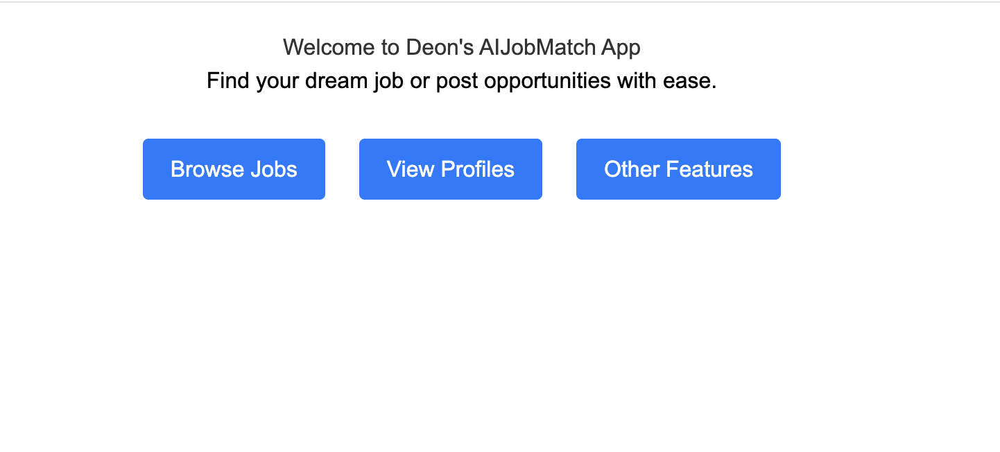
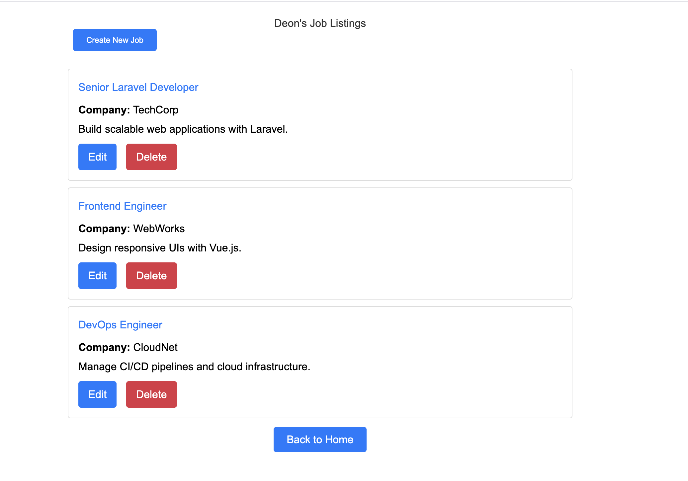
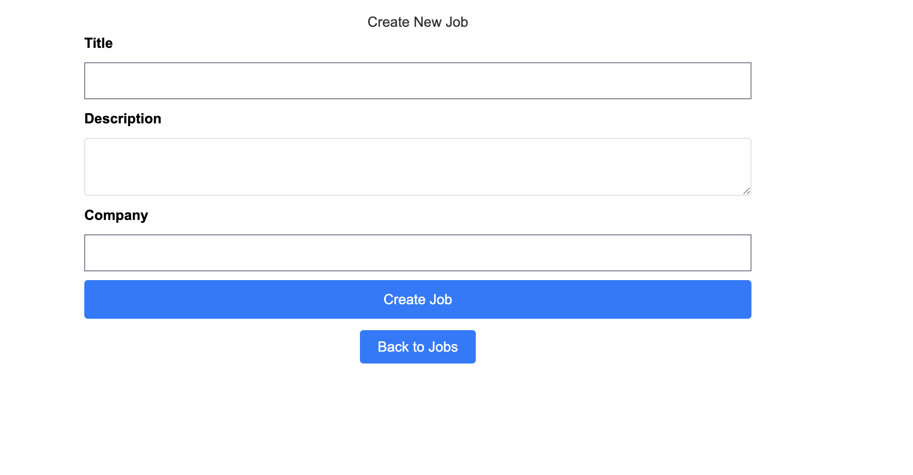
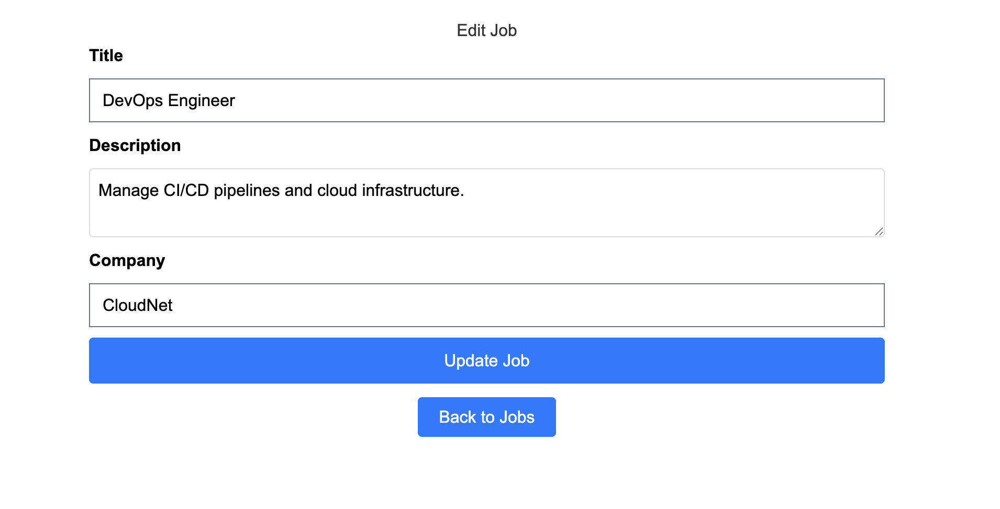

## AIJobMatch
- AIJobMatch is a full-stack web application built to demonstrate proficiency in the LAMP stack (Linux/macOS, Apache, MySQL, PHP) and modern - PHP development with Laravel. 
- It features robust CRUD operations for managing job listings, showcasing skills in backend development, database management, and responsive front-end design.

## Features
	-	CRUD Operations: Create, read, update, and delete job listings with validation and error handling.
	-	LAMP Stack: Built with Laravel 12.8.1, PHP 8.4.6, MySQL, and Apache on macOS (Homebrew).
	-	Database Design: MySQL schema with foreign key constraints and pivot tables for job-skill relationships.
	-	Dynamic Repopulation: Automatically resets job listings to a seeded state on page refresh.
	-	Responsive UI: Clean, user-friendly interface with Vite-powered CSS and JavaScript.
## Tech Stack
	-	Backend: Laravel 12.8.1, PHP 8.4.6
	-	Database: MySQL
	-	Server: Apache (Homebrew)
	-	Frontend: Blade templates, Tailwind CSS (via Vite)
	-	Version Control: Git, GitHub
## Screenshots

### AIJobMatch Homepage: 

### Job Listings: 

### Create Job: 

### Edit Job: 

## Installation
	-	Clone the repository:git clone https://github.com/Dar3071/AIJobMatch.git
	-	cd AIJobMatch
	-	Install dependencies:composer install
	-	npm install
	-	Configure environment:cp .env.example .env
	-	Update .env with your MySQL credentials (e.g., DB_DATABASE=aijobmatch, DB_USERNAME, DB_PASSWORD).
	-	Run migrations and seed:php artisan migrate
	-	php artisan db:seed
	-	Configure Apache:
	-	Ensure Apache is installed (e.g., via Homebrew: brew install httpd).
	-	Edit /opt/homebrew/etc/httpd/httpd.conf to listen on port 8080:Listen 8080
	-	Set document root to AIJobMatch/public:DocumentRoot "/path/to/AIJobMatch/public"
	-	<Directory "/path/to/AIJobMatch/public">
	-	    AllowOverride All
	-	    Require all granted
	-	</Directory>
	-	Restart Apache:brew services restart httpd
	-	Access at http://localhost:8080.
## Skills Demonstrated
	-	Backend Development: Laravel routing, controllers, Eloquent ORM, middleware.
	-	Database Management: MySQL schema design, foreign keys, seeding.
	-	Frontend Development: Blade templating, responsive design with Tailwind CSS.
	-	DevOps: Apache configuration, Git for version control, Homebrew setup.
	-	Problem Solving: Handled foreign key constraints and dynamic data repopulation without migrations.